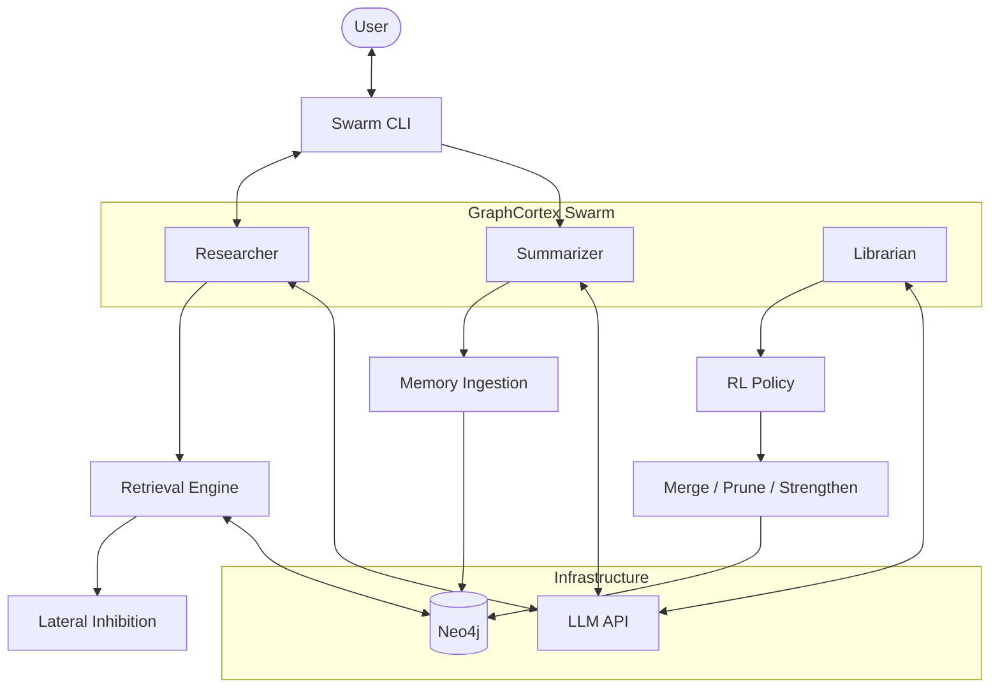
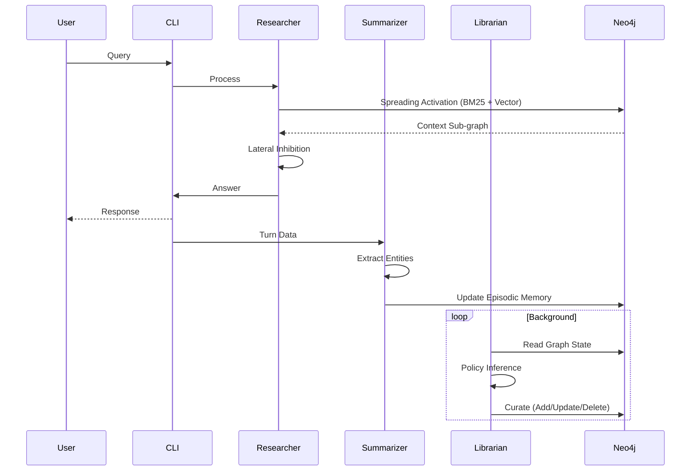

<p align="center">
  
</p>

<p align="center">
  A self-optimizing knowledge graph memory layer for AI agents, built on Neo4j.
</p>

<p align="center">
  <a href="./docs/implementation_plan_rl_training.md">RL Training Plan</a> &nbsp;·&nbsp;
  <a href="./src/graph_cortex/interfaces/cli/main.py">CLI</a>
</p>

<p align="center">
  
  
  
</p>

<p align="center">
  
</p>

---

## What this does

Most agent memory is passive — store what goes in, return what's asked for, degrade silently over time. Run any agent long enough and you hit three problems: duplicate/contradictory nodes from automated extraction, stale context that corrupts retrieval, and vector search that misses structural relationships.

GraphCortex is a memory layer that doesn't just store information — it restructures itself. Three agents run concurrently:

- **Researcher** — handles queries using spreading activation with lateral inhibition. Pulls tight context sub-graphs and reconstructs edges between anchor nodes via `shortestPath`.
- **Summarizer** — runs async after each turn. Extracts entities/relationships from conversations and wires them into the episodic timeline.
- **Librarian** — the interesting one. Runs an RL policy loop (PyTorch, REINFORCE) that observes graph state and decides whether to add bridging nodes, bump confidence on weak nodes, or soft-delete stale ones. Trained on HotpotQA via an LLM-as-judge reward signal.

The Librarian enforces memory immutability — it can update metadata (confidence, heat, access counts) but core factual properties (`name`, `summary`, etc.) are blocked at the environment level.

### Memory layers

| Layer | What it holds |
|---|---|
| Working Memory | Active conversation context |
| Episodic Memory | Time-stamped event chain (`:FOLLOWS` linked) |
| Semantic Memory | Entities, concepts, relationships |

---

## Architecture





---

## Quickstart

Deploys Neo4j + the Swarm CLI. Works on Mac (Intel/Apple Silicon), Linux, and Windows (WSL2).

```bash
git clone https://github.com/anonimity69/GraphCortex.git
cd GraphCortex
cp .env.example .env  # add your GEMINI_API_KEY
chmod +x setup.sh shutdown.sh
./setup.sh
```

| Action | Command |
|---|---|
| Start | `./setup.sh` |
| Stop | `./shutdown.sh` |
| Neo4j Browser | [localhost:7475](http://localhost:7475) |

The setup script handles port conflicts, waits for the DB to stabilize, and drops you into the CLI.

---

## CLI Commands

```
/data     - graph + dataset stats
/train    - run RL training (HotpotQA)
/curate   - trigger librarian manually
/monitor  - librarian metrics
/clear    - new session
/exit     - shutdown
```

---

## Stack

| Layer | Tech |
|---|---|
| Graph DB | Neo4j 2026.02 |
| Agents | Asyncio |
| RL | PyTorch (REINFORCE) |
| Search | Hybrid BM25 + Cosine Vector |
| LLM | Gemini / OpenAI / OpenRouter |

---

<p align="center">
  Built for agents that need to think longer than one conversation.
</p>
