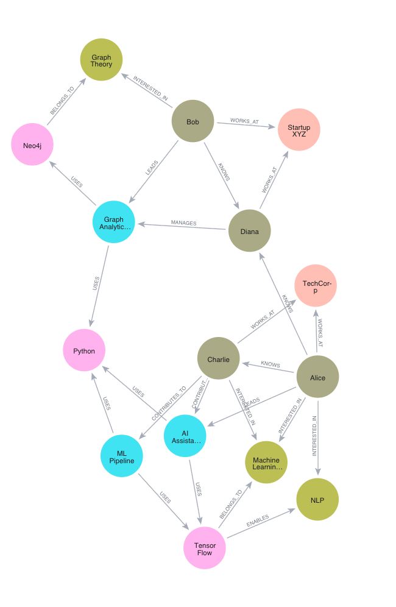

<p align="center">
  
</p>

<p align="center">
  Distributed neuro-symbolic graph memory for AI agents
</p>

<p align="center">
  <a href="./docs/implementation_plan_phase2.md">Implementation Plan</a> &nbsp;·&nbsp;
  <a href="./DECISIONS.md">Architecture Decisions</a> &nbsp;·&nbsp;
  <a href="./src/graph_cortex/interfaces/cli/main.py">Quickstart</a>
</p>

<p align="center">
  
  
  
  
</p>

---

GraphCortex is the neuro-symbolic memory and context layer for advanced AI agents, built specifically to solve the limitations of flat vector databases and generic RAG pipelines. 

Your AI forgets chronological context and topological relationships between concepts. GraphCortex fixes that.

It automatically extracts structural facts (entities and concepts), tracks strict chronological interaction histories, mathematically prevents hub-explosions during retrieval, and dynamically returns completely connected associative sub-graphs. 

| | |
|---|---|
| 🧠 **Working Memory** | Real-time bounded interactions. Acts as a strict short-term buffer before nodes are structurally summarized. |
| 📅 **Episodic Memory** | Chronological event summaries. Compresses interactions into searchable, sequential "events". |
| 🕸️ **Semantic Memory** | Entity-level abstractions. Maps global logic, extracting factual connections and recording exactly which interactions originated them. |
| 🔍 **Dual-Trigger Retrieval** | Hybrid lexical + semantic (vector) triggers. Finds exact concepts or soft semantic matches as search anchors. |
| ⚡ **Spreading Activation** | AI recalls memory exactly like the human brain—fanning out energy from an anchor node, bounded mathematically by Lateral Inhibition (The Fan Effect) to prevent context flooding. |

All of this is managed inside a highly scalable, strictly decoupled Clean Architecture mapping to Neo4j.



---

## Architecture Overview

<table>
<tr>
<td width="33%" valign="top">

<h3>🧠 Core</h3>

The pure mathematical theory of memory. Contains Working Memory logic, Lateral Inhibition math, and Energy Decay equations. Absolutely zero dependencies on Neo4j or external APIs.

</td>
<td width="33%" valign="top">

<h3>🔧 Infrastructure</h3>

The physical tooling. Contains isolated Cypher queries and the Neo4j Python Driver implementation. To migrate to an enterprise DB like AWS Neptune, simply swap this folder.

</td>
<td width="33%" valign="top">

<h3>🔌 Interfaces</h3>

The operational tier. How the system talks to the outside world, including CLI commands and test modules.

</td>
</tr>
</table>

---

## Give your AI memory (Quickstart)

GraphCortex provides an end-to-end executable backend pipeline. 

### Local Execution
1. Install requirements (`neo4j`, `python-dotenv`, `sentence-transformers`).
2. Run Neo4j locally via Docker using `docker-compose.yml`.
3. Secure your `.env` variables (`NEO4J_URI`, `NEO4J_USERNAME`, `NEO4J_PASSWORD`).

Run the built-in Native CLI to verify the ingestion and Spreading Activation pipelines:
```bash
python src/graph_cortex/interfaces/cli/main.py
```

### What your AI gets

| Layer | What it does |
|---|---|
| `MemoryManager` | The traffic-cop orchestrator. Exposes `process_turn()` for raw chat ingestion and `consolidate_episode()` for LLM-fact extraction tracking. |
| `RetrievalEngine` | The core query engine. Executes math-backed Spreading Activation starting from semantic vectors or keywords, finding neighbors up to $N$ hops away. |
| `Inhibition` | Energy decay math (`AE = initial_energy / (((distance * const) + 1) * ((degree * const) + 1))`). Drops massive generic hubs before they ruin the LLM's context window. |

---

## Why GraphCortex instead of Pinecone/RAG?

**Memory is not standard RAG.** RAG retrieves isolated document chunks. Vector databases are fundamentally flat and cannot natively construct multi-hop associative networks.

GraphCortex uses persistent Neo4j topology. It natively understands that "User A belongs_to StartUp Y", and "StartUp Y uses Pinecone". It explicitly tracks *facts over time* chronologically, allowing your agent to deduce deep, structural logic without guessing.

Read our full technical breakdown: **[DECISIONS.md](./DECISIONS.md)**

---

<p align="center">
  <strong>Give your AI a structural brain. It's about time.</strong>
</p>
