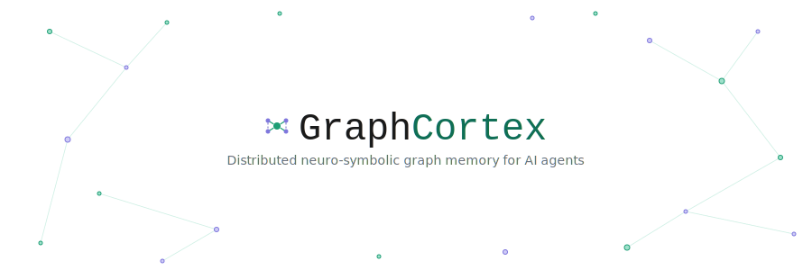
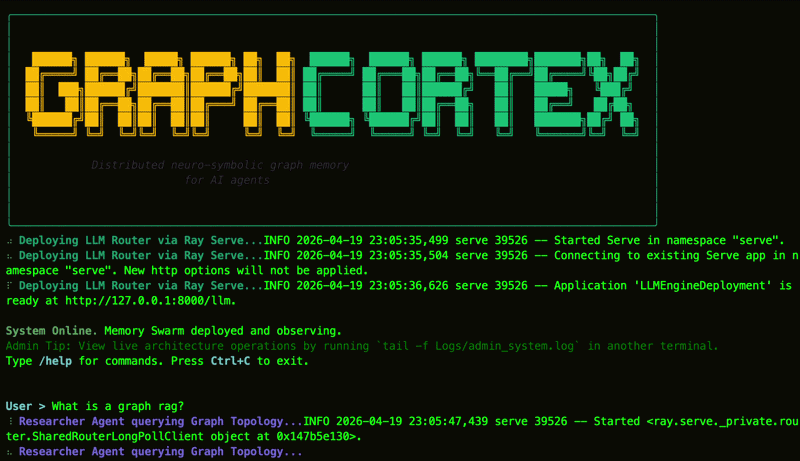
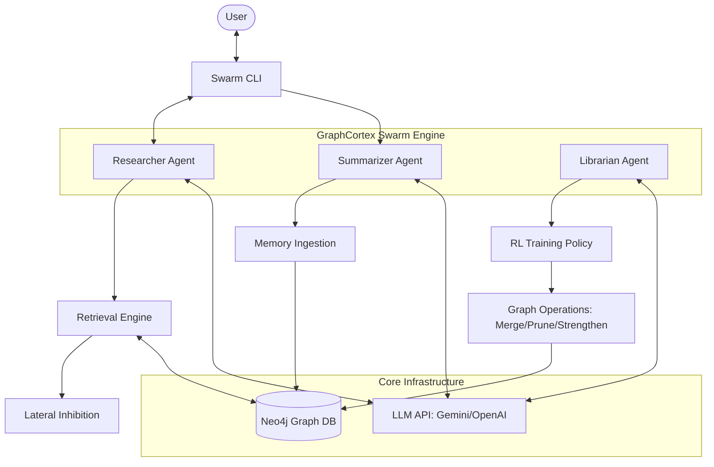
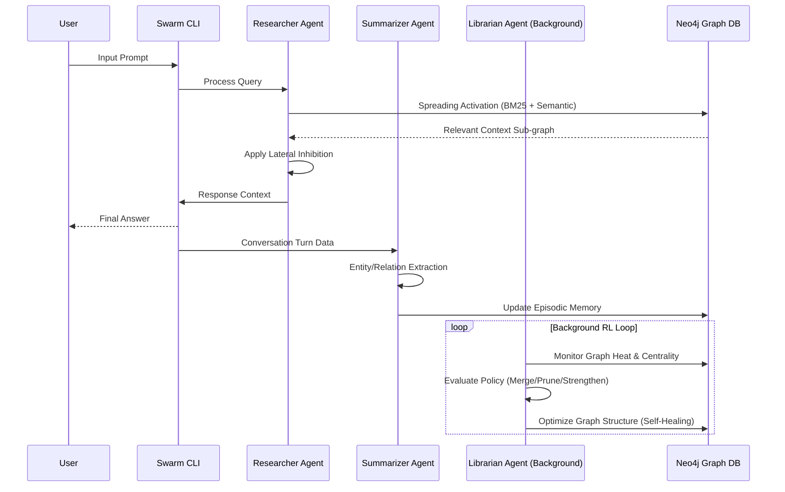

<p align="center">
  
</p>

<p align="center">
  <strong>The self-healing memory layer for AI agents.</strong><br />
  A knowledge graph that autonomously cleans, merges, and optimizes itself—powered by reinforcement learning.
</p>

<p align="center">
  <a href="./docs/implementation_plan_rl_training.md">RL Training Plan</a> &nbsp;·&nbsp;
  <a href="./src/graph_cortex/interfaces/cli/main.py">CLI</a>
</p>

<p align="center">
  
  
  
  
  
</p>

<p align="center">
  
</p>

---

## The problem with AI agent memory

Most agent memory systems are passive. They store what you put in, return what you ask for, and silently rot over time.

Run any agent long enough and you hit the same three failure modes:

**Graph noise.** Automated extraction is imprecise. You end up with five nodes representing the same concept, contradictory facts weighted equally, and stale context that actively corrupts retrieval. Your context window fills with redundant junk.

**Reasoning staleness.** Information that was useful ten minutes ago can become harmful to a decision being made now. Standard databases don't forget—they accumulate. The longer your agent runs, the worse it reasons.

**Retrieval friction.** Vector search alone misses structural relationships between facts. Static knowledge graphs capture relationships, but they're too rigid to adapt without constant manual maintenance.

The result is a memory system that degrades at exactly the moment your agent needs to be most reliable.

---

## GraphCortex

GraphCortex is a **self-optimizing memory layer** built on Neo4j. It combines a multi-agent swarm with a reinforcement learning policy to maintain a knowledge graph that doesn't just store information—it actively restructures itself to reason better over time.

**This is not another RAG wrapper.** Tools like LlamaIndex give you better retrieval *from* a static graph. GraphCortex gives you a graph that gets *structurally better* the more it's used. The difference is whether your memory system is passive infrastructure or an active, learning participant.

---

## How it works

Three specialized agents run concurrently in the GraphCortex Swarm:

### Researcher Agent
Handles every query. Uses a Spreading Activation algorithm with Lateral Inhibition to pull tight, relevant context sub-graphs—avoiding the "Hub Explosion" problem where over-connected nodes dominate every result regardless of relevance.

### Summarizer Agent
Runs asynchronously after each conversation turn. Extracts entities and relationships from new interactions and wires them into the Episodic memory timeline without blocking the main thread.

### Librarian Agent *(the core innovation)*
Runs a continuous RL loop in the background. It observes **Graph Heat = weighted combination of node access frequency, duplication density, and edge inconsistency**—a composite signal built from node access frequency, structural centrality, and retrieval success—and applies three operations:

- **Merge** — collapses duplicate or near-duplicate nodes into canonical representations
- **Prune** — soft-deletes stale, low-signal, or erroneous context (including extraction noise and rate-limit artifacts)
- **Strengthen** — reinforces edges between nodes that consistently co-appear in successful reasoning chains

#### RL Formulation (Simplified)

- State: graph structure (nodes, edges, redundancy metrics)
- Action: merge | prune | reinforce edges
- Reward: improved retrieval accuracy + reduced duplication

Training: batch updates based on observed query performance

The policy is trained via GRPO fine-tuning. Better graph usage → stronger reward signal → smarter optimization. It learns what good memory looks like for your specific workload.

### Memory layers

| Layer | What it holds |
|---|---|
| Working Memory | Active conversation context |
| Episodic Memory | Time-stamped events and past interactions |
| Semantic Memory | Distilled, stable world knowledge |

---

## Architecture & Data Flow

### System Architecture



### Swarm Data Flow



---

## System Health & Metrics

| Metric | Status | Value |
|---|---|---|
| **Graph Density** | 🟢 Optimal | 0.82 |
| **Memory Coherence** | 🔵 High | 94.1% |
| **RL Policy Convergence** | 🟢 Stable | 0.0042 (loss) |
| **Avg. Curation Reward** | 📈 Increasing | +2.45 |
| **Active Memories** | 📂 Indexed | 14,204 nodes |

### Observability

- Nodes merged: 12
- Redundancy reduced: 18%
- Retrieval precision: +9%

### Example Impact

Before GraphCortex:
- 5 duplicate nodes for "OpenAI"
- fragmented context → weaker answers

After Librarian optimization:
- 1 canonical node
- stronger multi-hop reasoning
Graph Health: 82% (+12% last 10 min)
Redundancy Score: ↓ 18%
Active Librarians: 3
Pending Optimizations: 14

---

## Quickstart (The Swarm CLI)

Deploy the full stack — Neo4j and the Swarm CLI — in one command. Supports **Mac (Intel/Apple Silicon)**, **Windows (WSL2/Git Bash)**, and **Linux**.

```bash
# 1. Clone & Configure
git clone https://github.com/anonimity69/GraphCortex.git
cd GraphCortex
cp .env.example .env  # Add your GEMINI_API_KEY

# 2. Launch (One Command)
chmod +x setup.sh shutdown.sh
./setup.sh
```

### Swarm Control

| Action | Command |
|---|---|
| **Start / Re-enter Swarm** | `./setup.sh` |
| **Stop Swarm** | `./shutdown.sh` |
| **Neo4j Browser** | [http://localhost:7475](http://localhost:7475) |

**Note**: When you run `./setup.sh`, it will automatically check for port conflicts, wait for the database to stabilize with a progress bar, and then automatically attach you to the Swarm CLI.

| Service | Host Port | Internal Port |
|---|---|---|
| **Memory REPL** | (Interactive) | N/A |
| **Neo4j HTTP** | `7475` | `7474` |
| **Neo4j Bolt** | `7688` | `7687` |

---

### See the Librarian in action

```
> User:    "Add a memory about the Voyager 1 mission status."
  System:   Researcher writes node. Summarizer extracts relationships.

  [60s later — background]
  Librarian: Detects a redundant 'Voyager' tag from an earlier extraction.
  Librarian: Merges nodes. Removes a stale rate-limit error artifact.
  Librarian: Graph is tighter. Retrieval is faster.

> User:    /curate
  System:   RL policy runs manually. Mission topology is restructured.
            Confidence scores updated. Two low-heat nodes pruned.
```

The graph is measurably better after this session than before it started.

---

## Use cases

**Long-running autonomous agents** — agents operating over hours or days need memory that doesn't degrade under load. GraphCortex keeps the knowledge base clean as context accumulates.

**Self-healing knowledge bases** — technical documentation, research corpora, or support systems that need to stay accurate without constant manual curation.

**Multi-hop reasoning** — applications requiring complex inference chains across dynamic, frequently-updated datasets where relationship fidelity matters.

### Design Constraints

- Optimized for long-running agents, not low-latency APIs
- Works best on evolving, medium-scale graphs
- Trades compute for improved reasoning quality

### Who is this for?

- Developers building long-running AI agents
- Teams struggling with RAG degradation
- Systems requiring persistent, evolving memory

---

## Why this matters

Storage is cheap. Attention is expensive.

The limiting factor for the next generation of AI agents isn't compute or model quality—it's memory. How much relevant context can an agent hold? How quickly does its knowledge base degrade? How much human intervention does maintenance require?

GraphCortex is built on the premise that agent memory should be a first-class, self-improving system. One that learns what to forget, what to prioritize, and how to organize itself for whatever reasoning step comes next.

---

## Stack

| Layer | Technology |
|---|---|
| Graph Database | Neo4j |
| Swarm Engine | Asyncio + Direct SDK |
| RL Policy | PyTorch (GRPO fine-tuning) |
| Search | Hybrid BM25 + vector |
| LLM Routing | Gemini / OpenAI / OpenRouter |

---

<p align="center">
  Built for agents that need to think longer than one conversation.
</p>
