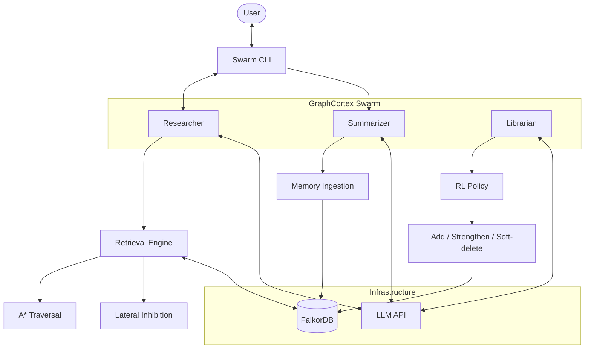

<p align="center">
  
</p>

<h1 align="center">GraphCortex</h1>

<p align="center">
  <strong>The self-healing memory layer for AI agents.</strong><br />
  A knowledge graph that prunes, strengthens, and extends itself in the background—guided by a reinforcement-learned policy.
</p>

<p align="center">
  <a href="#quickstart">Quickstart</a> &nbsp;·&nbsp;
  <a href="#architecture-under-the-hood">How it works</a> &nbsp;·&nbsp;
  <a href="https://github.com/anonimity69/GraphCortex/blob/main/DECISIONS.md">Design decisions</a> &nbsp;·&nbsp;
  <a href="https://github.com/anonimity69/GraphCortex/blob/main/CHANGELOG.md">Changelog</a>
</p>

<p align="center">
  
  
  
  
</p>


---

## The Problem

Most AI agent memory is passive. You store what goes in, return what's asked for, and watch it degrade silently over time. Run any autonomous agent long enough and you hit three walls:
1. **Fragmentation:** Automated extraction creates duplicate or contradictory nodes.
2. **Context Rot:** Stale information corrupts retrieval and confuses the LLM.
3. **Blind Spots:** Standard vector search misses multi-hop structural relationships.

## Enter GraphCortex

**GraphCortex is a memory layer that doesn't just store information — it restructures itself.** 

Built on FalkorDB, it runs a swarm of concurrent agents that continuously curate, connect, and optimize your agent's knowledge graph in the background using Reinforcement Learning.

### Core Features

- 🧠 **RL-Driven Curation (The Librarian):** A background PyTorch policy loop observes the graph state and decides each cycle whether to add a bridging concept, boost confidence on a weak node, soft-delete a stale one, or do nothing.
- ⚡ **A\*-Guided Retrieval (The Researcher):** Hybrid anchor search (BM25 + vector) feeds an A\* traversal that uses embedding similarity as its heuristic, with **Structural Edge-Weighting** that discounts logical relations (`REQUIRES`, `CAUSES`, `DEPENDS_ON`) and penalizes vague ones (`RELATES_TO`, `MENTIONS`).
- 🔄 **Async Consolidation (The Summarizer):** Automatically extracts entities and relationships from every interaction and wires them into a persistent episodic timeline.
- 🛡️ **Memory Immutability:** Core factual properties (`name`, `summary`, `content`) are blocked from modification at the RL environment level, so autonomous curation can move metadata like confidence and access counts without destroying facts.

### Where it stands

GraphCortex is pre-release and not yet deployed as a hosted service. Two things are worth
knowing before you build on it:

- **Hub suppression is not active on the A\* path.** Lateral inhibition currently computes
  its decay from traversal distance only — node degree is hardcoded, so dense hub nodes are
  not penalized the way the design intends. Tracked for 0.3.0.
- **The Librarian ships untrained.** No policy weights are included in the repository, so a
  fresh clone runs a randomly initialized policy until you run `/train`. The training loop
  itself is a bootstrap: the reward judge is fed ground truth rather than a real agent
  answer, so the signal is weak.

The [changelog](CHANGELOG.md) tracks these as they close.

---

## Quickstart

GraphCortex deploys FalkorDB + the Swarm CLI. Developed on Mac (Apple Silicon); Linux and Windows (WSL2) should work but are less tested.

**Recommended — from source**, which brings up FalkorDB for you:

```bash
git clone https://github.com/anonimity69/GraphCortex.git
cd GraphCortex

# Add your LLM provider key
cp .env.example .env

# Start the swarm
chmod +x setup.sh shutdown.sh
./setup.sh
```

| Action | Command |
|---|---|
| Start | `./setup.sh` |
| Stop | `./shutdown.sh` |
| Visualizer | [localhost:3000](http://localhost:3000) (FalkorDB Browser) |

*The setup script handles port conflicts, waits for the DB to stabilize, and drops you straight into the interactive CLI.*

**Or install the package** — note that this ships the library and CLI only. You still need a
reachable FalkorDB instance and an LLM key in the environment before `graphcortex` will
start:

```bash
pip install graphcortex
docker run -p 6379:6379 -p 3000:3000 falkordb/falkordb:latest
export GEMINI_API_KEY=...   # see .env.example for all settings
graphcortex
```

---

## Architecture Under the Hood

GraphCortex operates on a unified `:Searchable` graph schema to prevent node fragmentation across different memory episodes. 


```mermaid
graph TD
    User([User]) <--> CLI[Swarm CLI]
    
    subgraph Swarm[GraphCortex Swarm]
        Researcher[Researcher]
        Summarizer[Summarizer]
        Librarian[Librarian]
    end
    
    CLI <--> Researcher
    Researcher --> RetrievalEngine[Retrieval Engine]
    RetrievalEngine --> AStar[A* Traversal]
    RetrievalEngine --> Inhibition[Lateral Inhibition]
    
    CLI --> Summarizer
    Summarizer --> Ingestion[Memory Ingestion]
    
    Librarian --> RL[RL Policy]
    RL --> GraphOps[Add / Strengthen / Soft-delete]
    
    subgraph Infra[Infrastructure]
        FalkorDB[(FalkorDB)]
        LLM[LLM API]
    end
    
    RetrievalEngine <--> FalkorDB
    Ingestion --> FalkorDB
    GraphOps --> FalkorDB
    Researcher <--> LLM
    Summarizer <--> LLM
    Librarian <--> LLM
```

---

## CLI Commands

Manage your swarm directly from the terminal:

```bash
/data     # View graph + dataset stats
/train    # Run RL training (HotpotQA)
/curate   # Trigger librarian manually
/monitor  # View librarian metrics
/clear    # Start a new session
/exit     # Shutdown gracefully
```

---

<p align="center">
  <i>Built for agents that need to think longer than one conversation.</i>
</p>
