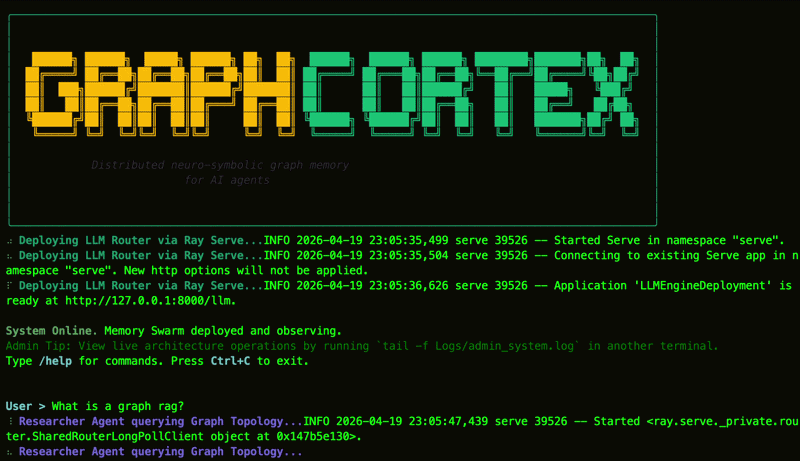
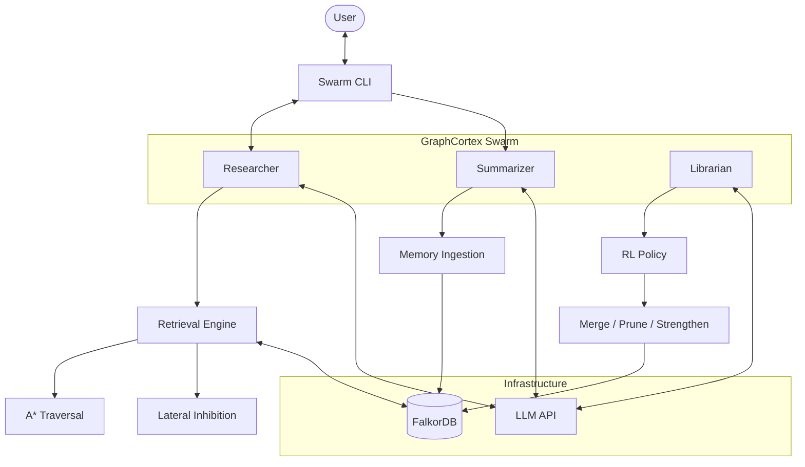

<p align="center">
  
</p>

<h1 align="center">GraphCortex</h1>

<p align="center">
  <strong>The self-healing memory layer for AI agents.</strong><br />
  A knowledge graph that autonomously cleans, merges, and optimizes itself—powered by reinforcement learning.
</p>

<p align="center">
  <a href="#quickstart">Quickstart</a> &nbsp;·&nbsp;
  <a href="#architecture-under-the-hood">How it works</a> &nbsp;·&nbsp;
  <a href="./docs/implementation_plan_rl_training.md">RL Training</a>
</p>

<p align="center">
  
  
  
</p>

<p align="center">
  
</p>

---

## The Problem

Most AI agent memory is passive. You store what goes in, return what's asked for, and watch it degrade silently over time. Run any autonomous agent long enough and you hit three walls:
1. **Fragmentation:** Automated extraction creates duplicate or contradictory nodes.
2. **Context Rot:** Stale information corrupts retrieval and confuses the LLM.
3. **Blind Spots:** Standard vector search misses multi-hop structural relationships.

## Enter GraphCortex

**GraphCortex is a memory layer that doesn't just store information — it restructures itself.** 

Built on FalkorDB, it runs a swarm of concurrent agents that continuously curate, connect, and optimize your agent's knowledge graph in the background using Reinforcement Learning.

### Core Features

- 🧠 **RL-Driven Curation (The Librarian):** A background PyTorch policy loop observes the graph state and autonomously decides to add bridging concepts, boost confidence on weak nodes, or soft-delete stale ones.
- ⚡ **A*-Guided Retrieval (The Researcher):** Bypasses dense noise clusters using hybrid search (BM25 + Vector) combined with **Structural Edge-Weighting**. It penalizes weak connections and aggressively pursues high-value paths.
- 🔄 **Async Consolidation (The Summarizer):** Automatically extracts entities and relationships from every interaction and wires them into a persistent episodic timeline.
- 🛡️ **Memory Immutability:** Core factual properties are blocked from unauthorized modification at the environment level, ensuring graph structural integrity while metadata (heat, access counts) remains fluid.

---

## Quickstart

GraphCortex deploys FalkorDB + the Swarm CLI. Works seamlessly on Mac (Apple Silicon/Intel), Linux, and Windows (WSL2).

```bash
git clone https://github.com/anonimity69/GraphCortex.git
cd GraphCortex

# Add your LLM provider key
cp .env.example .env

# Start the swarm
chmod +x setup.sh shutdown.sh
./setup.sh
```

| Action | Command |
|---|---|
| Start | `./setup.sh` |
| Stop | `./shutdown.sh` |
| Visualizer | [localhost:3000](http://localhost:3000) (FalkorDB Browser) |

*The setup script handles port conflicts, waits for the DB to stabilize, and drops you straight into the interactive CLI.*

---

## Architecture Under the Hood

GraphCortex operates on a unified `:Searchable` graph schema to prevent node fragmentation across different memory episodes. 


```mermaid
graph TD
    User([User]) <--> CLI[Swarm CLI]
    
    subgraph Swarm[GraphCortex Swarm]
        Researcher[Researcher]
        Summarizer[Summarizer]
        Librarian[Librarian]
    end
    
    CLI <--> Researcher
    Researcher --> RetrievalEngine[Retrieval Engine]
    RetrievalEngine --> AStar[A* Traversal]
    RetrievalEngine --> Inhibition[Lateral Inhibition]
    
    CLI --> Summarizer
    Summarizer --> Ingestion[Memory Ingestion]
    
    Librarian --> RL[RL Policy]
    RL --> GraphOps[Merge / Prune / Strengthen]
    
    subgraph Infra[Infrastructure]
        FalkorDB[(FalkorDB)]
        LLM[LLM API]
    end
    
    RetrievalEngine <--> FalkorDB
    Ingestion --> FalkorDB
    GraphOps --> FalkorDB
    Researcher <--> LLM
    Summarizer <--> LLM
    Librarian <--> LLM
```

---

## CLI Commands

Manage your swarm directly from the terminal:

```bash
/data     # View graph + dataset stats
/train    # Run RL training (HotpotQA)
/curate   # Trigger librarian manually
/monitor  # View librarian metrics
/clear    # Start a new session
/exit     # Shutdown gracefully
```

---

<p align="center">
  <i>Built for agents that need to think longer than one conversation.</i>
</p>
