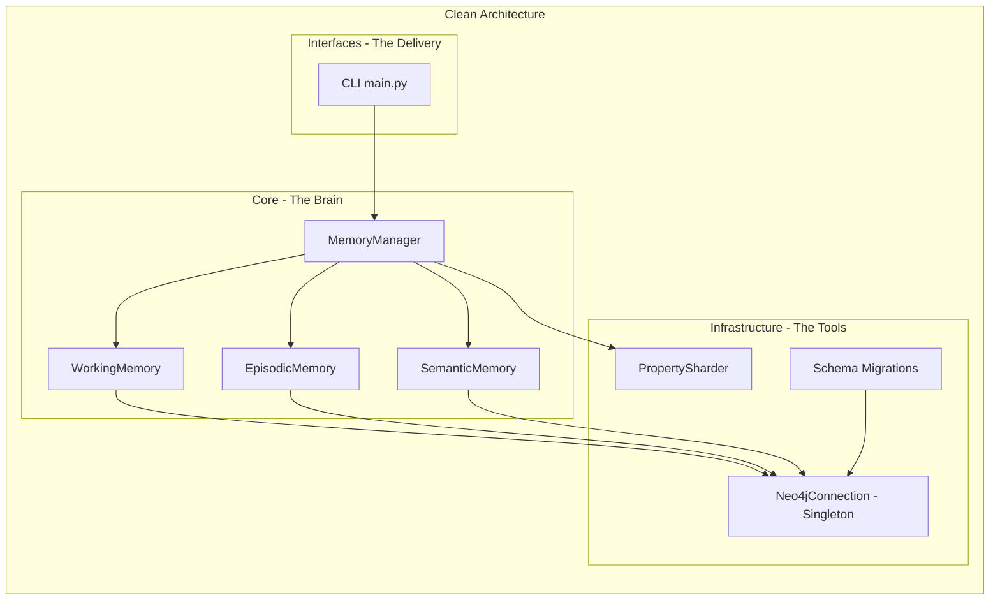
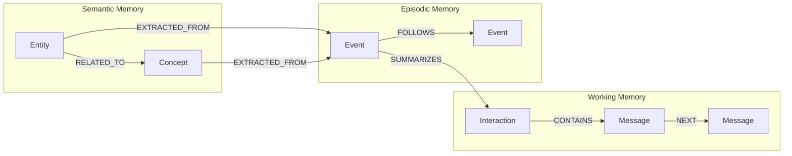

# 📋 Phase 1 Report Card — Storage Substrate & Multi-Layer Memory Framework

**Project:** GraphCortex — Distributed Neuro-Symbolic Memory Grid  
**Phase:** 1 — Storage Substrate (MLMF)  
**Date:** 12–13 April 2026  
**Status:** ✅ **COMPLETE**

---

## 🎯 Objective

Build the foundational storage substrate for a neuro-symbolic memory system. Replace flat vector databases with a structured, multi-layered Neo4j Knowledge Graph capable of storing Working Memory (real-time conversations), Episodic Memory (chronological event summaries), and Semantic Memory (entity-level abstractions) — all interconnected in a single graph topology.

---

## 📊 Final Scorecard

| Component | Plan | Delivered | Grade |
|---|---|---|:---:|
| Docker Infrastructure | Neo4j container with APOC + GDS | `docker-compose.yml` with Neo4j 5.18.1, APOC, GDS | **A** |
| Environment Config | `.env` template for connection vars | `.env` + `.env.example` with URI/user/password | **A** |
| Database Connectivity | Thread-safe Neo4j driver | Singleton `Neo4jConnection` class with `get_session()` | **A** |
| Schema Migrations | Constraints + indexes | Uniqueness constraints + timestamp indexes for all layers | **A** |
| Working Memory | `Interaction` + `Message` nodes | Delivered with `[:CONTAINS]` and `[:NEXT]` chaining | **A** |
| Episodic Memory | `Event` nodes with chronological chains | Delivered with `[:SUMMARIZES]` and `[:FOLLOWS]` relationships | **A** |
| Semantic Memory | `Entity` + `Concept` extraction | Delivered with `[:RELATED_TO]` and `[:EXTRACTED_FROM]` links | **A** |
| Memory Manager | Orchestrator pipeline | `MemoryManager` with `process_turn()` + `consolidate_episode()` | **A** |
| Property Sharding | Abstraction for heavy payload offloading | `PropertySharder` with local/S3 modes | **A** |
| Clean Architecture | Domain-driven folder structure | `core/` → `infrastructure/` → `interfaces/` separation | **A+** |

> **Overall Grade: A**

---

## 📁 Files Created

### Infrastructure Layer
| File | Purpose |
|---|---|
| [docker-compose.yml](file:///Users/shrayanendranathmandal/Developer/GraphCortex/docker-compose.yml) | Neo4j 5.18.1 container with APOC + GDS plugins, port mapping (7474/7687), health checks |
| [.env](file:///Users/shrayanendranathmandal/Developer/GraphCortex/.env) | `NEO4J_URI`, `NEO4J_USERNAME`, `NEO4J_PASSWORD` environment variables |
| [neo4j_connection.py](file:///Users/shrayanendranathmandal/Developer/GraphCortex/src/graph_cortex/infrastructure/db/neo4j_connection.py) | Singleton Neo4j driver with `get_session()` and `execute_read_query()` |
| [schema_migrations.py](file:///Users/shrayanendranathmandal/Developer/GraphCortex/src/graph_cortex/infrastructure/db/schema_migrations.py) | Constraint + index initialization for all memory layers |
| [sharding.py](file:///Users/shrayanendranathmandal/Developer/GraphCortex/src/graph_cortex/infrastructure/storage/sharding.py) | Property sharding abstraction (local passthrough / S3 URI mode) |

### Core Memory Layer
| File | Purpose |
|---|---|
| [working.py](file:///Users/shrayanendranathmandal/Developer/GraphCortex/src/graph_cortex/core/memory/working.py) | `WorkingMemory` class — `add_interaction()`, `add_message()` with `[:NEXT]` chaining |
| [episodic.py](file:///Users/shrayanendranathmandal/Developer/GraphCortex/src/graph_cortex/core/memory/episodic.py) | `EpisodicMemory` class — `create_event()` with `[:FOLLOWS]` chronological chains |
| [semantic.py](file:///Users/shrayanendranathmandal/Developer/GraphCortex/src/graph_cortex/core/memory/semantic.py) | `SemanticMemory` class — `add_entity()`, `extract_from_event()` with relational links |
| [manager.py](file:///Users/shrayanendranathmandal/Developer/GraphCortex/src/graph_cortex/core/memory/manager.py) | `MemoryManager` orchestrator — `process_turn()` + `consolidate_episode()` pipeline |

### Project Foundation
| File | Purpose |
|---|---|
| [pyproject.toml](file:///Users/shrayanendranathmandal/Developer/GraphCortex/pyproject.toml) | Project metadata, dependencies (`neo4j>=5.0.0`, `python-dotenv>=1.0.0`), CLI entry point |
| [README.md](file:///Users/shrayanendranathmandal/Developer/GraphCortex/README.md) | Full project documentation with architecture overview and quickstart |
| [DECISIONS.md](file:///Users/shrayanendranathmandal/Developer/GraphCortex/DECISIONS.md) | Architectural decision records (Neo4j vs flat vectors, Clean Architecture rationale) |

---

## 🏗️ Architecture Established

---

## 🗂️ Neo4j Graph Schema

### Constraints & Indexes Created
| Type | Target | Property |
|---|---|---|
| Index | `Interaction` | `timestamp` |
| Index | `Message` | `message_id` |
| Unique Constraint | `Event` | `event_id` |
| Index | `Event` | `timestamp` |
| Unique Constraint | `Entity` | `name` |
| Unique Constraint | `Concept` | `name` |

---

## 📜 Git History

| Date | Commit | Description |
|---|---|---|
| 12 Apr | `d435b0d` | Initial commit |
| 13 Apr | `36e6586` | Restructure to domain-driven design + Phase 1 MLMF |
| 13 Apr | `d4d5344` | Update README with architecture and roadmap |
| 13 Apr | `078c9a0` | Move implementation plan to `docs/` directory |
| 14 Apr | `4bf94a4` | Polish episodic queries + clarify singleton docs |

---

## 📝 Summary

Phase 1 established the entire foundation of GraphCortex — from the Docker containerisation and Neo4j driver connectivity to the full Multi-Layer Memory Framework. The three-tier memory system (Working → Episodic → Semantic) was implemented with strict Clean Architecture separation, ensuring the core mathematical memory logic has absolutely zero dependencies on the database layer. The `MemoryManager` orchestrator provides a clean API (`process_turn()` + `consolidate_episode()`) that downstream phases build upon. Property sharding was abstracted early to allow future migration to distributed storage (S3/MongoDB) without touching core logic.
