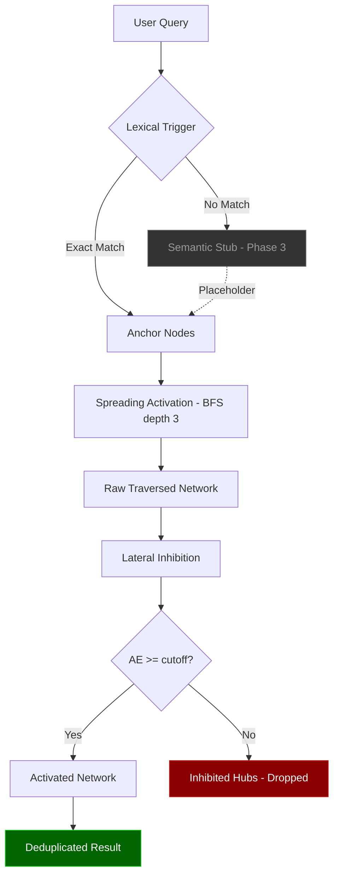

# 📋 Phase 2 Report Card — Spreading Activation Retrieval Engine

**Project:** GraphCortex — Distributed Neuro-Symbolic Memory Grid  
**Phase:** 2 — Retrieval Engine  
**Date:** 14 April 2026  
**Status:** ✅ **COMPLETE**

---

## 🎯 Objective

Build a brain-inspired retrieval engine that replaces standard cosine similarity with a dynamic Spreading Activation algorithm. The engine fans outward from anchor nodes, mathematically attenuating activation energy via the Fan Effect (degree penalty) and distance decay, while applying Lateral Inhibition to suppress generic hub nodes that would otherwise flood the AI's context window.

---

## 📊 Final Scorecard

| Component | Plan | Delivered | Grade |
|---|---|---|:---:|
| Dual-Trigger Initialization | Lexical + Semantic trigger routing | Lexical trigger active, Semantic stub prepared for Phase 3 | **A** |
| RetrievalEngine Class | Core orchestrator for recall | `RetrievalEngine` with configurable `cutoff_threshold` + `max_depth` | **A** |
| Spreading Activation (BFS) | Custom Cypher traversal up to depth 3 | Parameterised BFS query returning distance + degree metrics | **A** |
| Energy Decay Formula | Mathematical fan-effect attenuation | `AE = E / (((d × dp) + 1) × ((deg × degp) + 1))` implemented | **A** |
| Lateral Inhibition | Filter overly generic hubs | `apply_lateral_inhibition()` with configurable cutoff threshold | **A** |
| Infrastructure Queries | Scalable, parameterised Cypher | `get_anchor_nodes_by_name()` + `execute_spreading_activation_hop()` | **A** |
| CLI Verification | End-to-end retrieval demo | Updated `main.py` with full ingestion → retrieval pipeline | **A** |
| Clean Architecture | Core/Infra separation | Math in `core/retrieval/`, Cypher in `infrastructure/db/queries/` | **A+** |

> **Overall Grade: A**

---

## 📁 Files Created & Modified

### Core Retrieval Logic (The Math)
| File | Purpose |
|---|---|
| [engine.py](file:///Users/shrayanendranathmandal/Developer/GraphCortex/src/graph_cortex/core/retrieval/engine.py) | `RetrievalEngine` class — Dual-Trigger routing, energy decay orchestration, network deduplication |
| [inhibition.py](file:///Users/shrayanendranathmandal/Developer/GraphCortex/src/graph_cortex/core/retrieval/inhibition.py) | Lateral Inhibition module — Fan Effect energy decay formula, hub suppression |

### Infrastructure Queries (The Execution)
| File | Purpose |
|---|---|
| [retrieval_queries.py](file:///Users/shrayanendranathmandal/Developer/GraphCortex/src/graph_cortex/infrastructure/db/queries/retrieval_queries.py) | `get_anchor_nodes_by_name()` (Lexical) + `execute_spreading_activation_hop()` (BFS) |
| [neo4j_connection.py](file:///Users/shrayanendranathmandal/Developer/GraphCortex/src/graph_cortex/infrastructure/db/neo4j_connection.py) | Added `execute_read_query()` for safe read-only transactions |

### Interface
| File | Purpose |
|---|---|
| [main.py](file:///Users/shrayanendranathmandal/Developer/GraphCortex/src/graph_cortex/interfaces/cli/main.py) | Updated CLI with full ingestion → retrieval verification pipeline |

---

## 🧮 The Energy Decay Formula

The core mathematical innovation of Phase 2 is the Activation Energy (AE) decay function, designed to simulate how the biological brain attenuates signal strength as it fans outward through neural networks:

```
AE = initial_energy / (((distance × distance_penalty) + 1) × ((degree × degree_penalty) + 1))
```

### Parameters
| Parameter | Default | Purpose |
|---|---|---|
| `initial_energy` | `1.0` | Maximum energy assigned to exact anchor matches |
| `distance_penalty` | `0.5` | How fast energy decays with each hop away from the anchor |
| `degree_penalty` | `0.1` | How fast energy decays for highly connected (generic) hub nodes |
| `cutoff_threshold` | `0.2` | Minimum AE required to survive — nodes below this are inhibited |

### Worked Example
```
Node: "Neo4j Driver" (3 hops away, degree 4)
AE = 1.0 / (((3 × 0.5) + 1) × ((4 × 0.1) + 1))
AE = 1.0 / (2.5 × 1.4)
AE = 1.0 / 3.5
AE = 0.2857 ✅ (Above 0.2 threshold — SURVIVES)

Node: "Generic Hub" (3 hops away, degree 20)
AE = 1.0 / (((3 × 0.5) + 1) × ((20 × 0.1) + 1))
AE = 1.0 / (2.5 × 3.0)
AE = 1.0 / 7.5
AE = 0.1333 ❌ (Below 0.2 threshold — INHIBITED)
```

---

## 🏗️ Retrieval Pipeline Architecture



> [!NOTE]
> The Semantic Trigger (dashed box) was deliberately left as a stub in Phase 2. It was fully activated in Phase 3 with the `bge-base-en-v1.5` vector fallback.

---

## 🔧 Key Design Decisions

### 1. Clean Architecture Separation
The retrieval engine is split into two strict layers:
- **`core/retrieval/`** — Contains only pure mathematical functions (`inhibition.py`) and orchestration logic (`engine.py`). Zero database imports.
- **`infrastructure/db/queries/`** — Contains raw Cypher queries that return distance/degree metrics. The core layer consumes these metrics without knowing they came from Neo4j.

### 2. Configurable Thresholds
All decay parameters (`cutoff_threshold`, `max_depth`, `degree_penalty`, `distance_penalty`) are configurable at `RetrievalEngine` instantiation, allowing fine-tuning per use case.

### 3. Network Deduplication
When multiple anchors are activated, their spreading activation networks can overlap. The engine deduplicates by `node_id`, always keeping the instance with the highest activation energy.

---

## 📜 Git History

| Date | Commit | Description |
|---|---|---|
| 14 Apr | `950d213` | Implement dual-trigger spreading activation retrieval engine with lateral inhibition |
| 14 Apr | `6f81cd7` | Rename implementation_plan to implementation_plan_phase1 for clarity |

---

## 📝 Summary

Phase 2 delivered the cognitive retrieval engine at the heart of GraphCortex. Unlike standard RAG systems that return flat, isolated document chunks, the Spreading Activation algorithm traverses the Knowledge Graph outward from anchor nodes, building a connected associative sub-graph that the AI can reason over. The Lateral Inhibition module mathematically prevents the "Hub Explosion" problem — where overly generic concepts (like "User" or "Project") would otherwise dominate the AI's context window. The architecture was designed with a deliberate Semantic Trigger stub, cleanly bridged in Phase 3 with vector embeddings.
