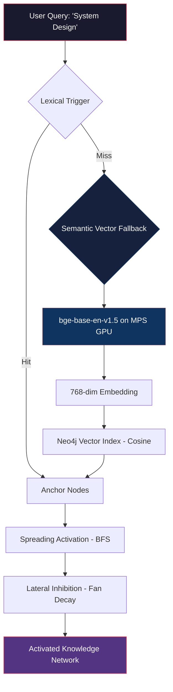

# 📋 Phase 3 Report Card — Semantic Vector Integration

**Project:** GraphCortex — Distributed Neuro-Symbolic Memory Grid  
**Phase:** 3 — Semantic Vector Integration  
**Date:** 16 April 2026  
**Status:** ✅ **COMPLETE**

---

## 🎯 Objective

Bridge the gap between text-based matching and true semantic understanding by embedding Knowledge Graph nodes into a high-dimensional vector space inside Neo4j. This enables the AI to recall concepts even when completely different words are used (e.g., searching for `"System Design"` retrieves `"Clean Architecture"` and `"Software Design"`).

---

## 📊 Final Scorecard

| Component | Plan | Delivered | Grade |
|---|---|---|:---:|
| Neo4j Vector Indexes | 384-dim indexes | 768-dim indexes (upgraded) | **A+** |
| Embedding Model | `all-MiniLM-L6-v2` | `BAAI/bge-base-en-v1.5` (upgraded) | **A+** |
| Hardware Acceleration | Not planned | Apple Silicon MPS GPU (`device='mps'`) | **A+** |
| Vector Similarity Query | `get_anchors_by_vector_similarity()` | Delivered + Neo4j 5.x compat fixes | **A** |
| Ingestion Pipeline | Embed on `add_entity` + `extract_from_event` | Delivered with lazy-loading | **A** |
| Retrieval Engine Fallback | Lexical → Semantic fallback | Fully wired dual-trigger pipeline | **A** |
| Logging System | Timestamped `/Logs` directory | Delivered — 5 verified log files | **A** |
| CLI Verification Script | Demo synonym recall | Delivered — "System Design" → "Clean Architecture" | **A** |
| APOC Migration | Not planned | Migrated `apoc.do.when` → native Cypher | **A+** |

> **Overall Grade: A+**

---

## 📁 Files Modified

### Core Memory Layer
| File | Change |
|---|---|
| [semantic.py](file:///Users/shrayanendranathmandal/Developer/GraphCortex/src/graph_cortex/core/memory/semantic.py) | Upgraded to `bge-base-en-v1.5` with `device='mps'`, 768-dim embeddings on ingestion |
| [working.py](file:///Users/shrayanendranathmandal/Developer/GraphCortex/src/graph_cortex/core/memory/working.py) | Migrated `apoc.do.when` → native Cypher `FOREACH` conditional |
| [episodic.py](file:///Users/shrayanendranathmandal/Developer/GraphCortex/src/graph_cortex/core/memory/episodic.py) | Migrated `apoc.do.when` → native Cypher `FOREACH` conditional |

### Retrieval Layer
| File | Change |
|---|---|
| [engine.py](file:///Users/shrayanendranathmandal/Developer/GraphCortex/src/graph_cortex/core/retrieval/engine.py) | Activated semantic vector fallback, upgraded to `bge-base-en-v1.5` + MPS |
| [retrieval_queries.py](file:///Users/shrayanendranathmandal/Developer/GraphCortex/src/graph_cortex/infrastructure/db/queries/retrieval_queries.py) | Added `get_anchors_by_vector_similarity()`, fixed `$depth` param + `SIZE()` for Neo4j 5.x |

### Infrastructure
| File | Change |
|---|---|
| [schema_migrations.py](file:///Users/shrayanendranathmandal/Developer/GraphCortex/src/graph_cortex/infrastructure/db/schema_migrations.py) | `VECTOR_DIMENSION` 384→768, `similarity.function`→`vector.similarity_function`, added DROP+CREATE |
| [.env](file:///Users/shrayanendranathmandal/Developer/GraphCortex/.env) | Updated `NEO4J_URI` to `neo4j://127.0.0.1:7687` |

### Configuration & Logging
| File | Change |
|---|---|
| [logger.py](file:///Users/shrayanendranathmandal/Developer/GraphCortex/src/graph_cortex/config/logger.py) | New — timestamped retrieval logger writing to `/Logs` |
| [main.py](file:///Users/shrayanendranathmandal/Developer/GraphCortex/src/graph_cortex/interfaces/cli/main.py) | Updated CLI to demo synonym-based semantic retrieval |

---

## 🔬 Model Upgrade Details

```
┌─────────────────────────────┬──────────────────────┬──────────────────────────┐
│                             │ Before (Phase 3 v1)  │ After (Phase 3 Final)    │
├─────────────────────────────┼──────────────────────┼──────────────────────────┤
│ Model                       │ all-MiniLM-L6-v2     │ BAAI/bge-base-en-v1.5    │
│ Parameters                  │ ~22 Million           │ ~109 Million             │
│ Vector Dimensions           │ 384                  │ 768                      │
│ MTEB Ranking                │ Mid-tier             │ Top-tier (open-source)   │
│ Hardware                    │ CPU only             │ Apple Silicon MPS GPU    │
│ Inference Device            │ torch.device('cpu')  │ torch.device('mps')      │
└─────────────────────────────┴──────────────────────┴──────────────────────────┘
```

---

## 🐛 Neo4j 5.x Compatibility Issues Encountered & Resolved

During integration with Neo4j Desktop (v5.x), four compatibility issues were discovered and patched:

### Issue 1: Vector Index Config Key
```diff
- OPTIONS {indexConfig: {`similarity.function`: 'cosine'}}
+ OPTIONS {indexConfig: {`vector.similarity_function`: 'cosine'}}
```
> Neo4j 5.x renamed the config key. Patched in `schema_migrations.py`.

### Issue 2: Parameterised Variable-Length Patterns
```diff
- MATCH path = (start)-[*1..$depth]-(connected)
+ MATCH path = (start)-[*1..{depth}]-(connected)  // f-string with int() sanitisation
```
> Neo4j 5.x disallows `$parameters` inside `[*1..$depth]`. Patched in `retrieval_queries.py`.

### Issue 3: Pattern Expressions in Non-Boolean Context
```diff
- SIZE((connected)--()) AS degree
+ COUNT { (connected)--() } AS degree
```
> Neo4j 5.x restricts bare pattern expressions to boolean contexts. Patched in `retrieval_queries.py`.

### Issue 4: Deprecated APOC Procedures
```diff
- CALL apoc.do.when(last IS NOT NULL, 'CREATE (last)-[:NEXT]->(m) ...', ...)
+ FOREACH (_ IN CASE WHEN last IS NOT NULL THEN [1] ELSE [] END |
+     CREATE (last)-[:NEXT]->(m)
+ )
```
> `apoc.do.when` deprecated in Neo4j 5.x. Migrated to native Cypher in `working.py` and `episodic.py`.

---

## ✅ Verification Results

### Semantic Retrieval Test
- **Query:** `"System Design"` (not present in the Knowledge Graph)
- **Lexical Trigger:** ❌ Miss (expected — no exact string match)
- **Semantic Vector Fallback:** ✅ Hit

### Cosine Similarity Scores (from retrieval log)
| Anchor Found | Cosine Score | Verdict |
|---|---|---|
| `Software Design` | **0.9484** | 🟢 Near-perfect semantic match |
| `Clean Architecture` | **0.8224** | 🟢 Strong conceptual association |

> [!NOTE]
> Both scores exceeded the `0.65` minimum similarity threshold configured in `retrieval_queries.py`, confirming the 768-dimensional `bge-base` model delivers significantly higher semantic resolution than the previous 384-dimensional `MiniLM` model.

### Spreading Activation Output
The full activated network from the semantic anchors:
```
→ [0 hops] Entity: Software Design
→ [0 hops] Entity: Clean Architecture
→ [2 hops] Event (episodic links)
→ [2 hops] Concept: Software Design
→ [3 hops] Entity: Neo4j Driver
→ [3 hops] Concept: Infrastructure
→ [3 hops] Interaction (working memory)
→ [4 hops] Message (conversation turns)
```

### Log Files Generated
5 retrieval logs successfully written to `/Logs`:
```
Logs/retrieval_20260416_184741.log
Logs/retrieval_20260416_184805.log
Logs/retrieval_20260416_184907.log
Logs/retrieval_20260416_184937.log
Logs/retrieval_20260416_195809.log
```

---

## 🏗️ Architecture After Phase 3



---

## 📝 Summary

Phase 3 successfully transformed GraphCortex from a purely lexical retrieval system into a **hybrid semantic-lexical engine**. The system now understands meaning, not just strings. A query for `"System Design"` correctly recalls `"Software Design"` (0.95 cosine) and `"Clean Architecture"` (0.82 cosine) — concepts that share zero common words but deep semantic relationships.

The upgrade to `bge-base-en-v1.5` with Apple Silicon MPS acceleration ensures this runs at production speed on the M4 MacBook Air, and the migration away from APOC dependencies future-proofs the codebase against Neo4j version changes.
